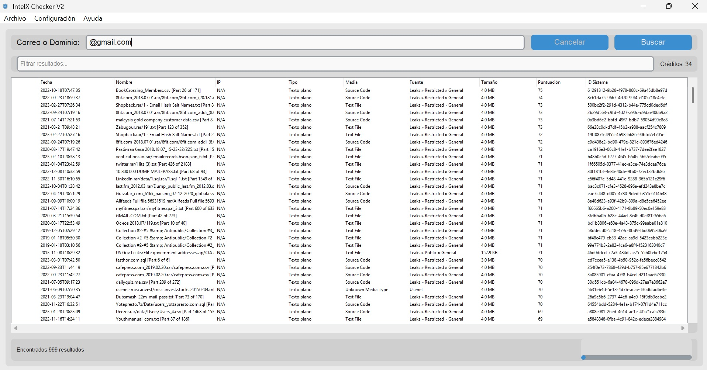
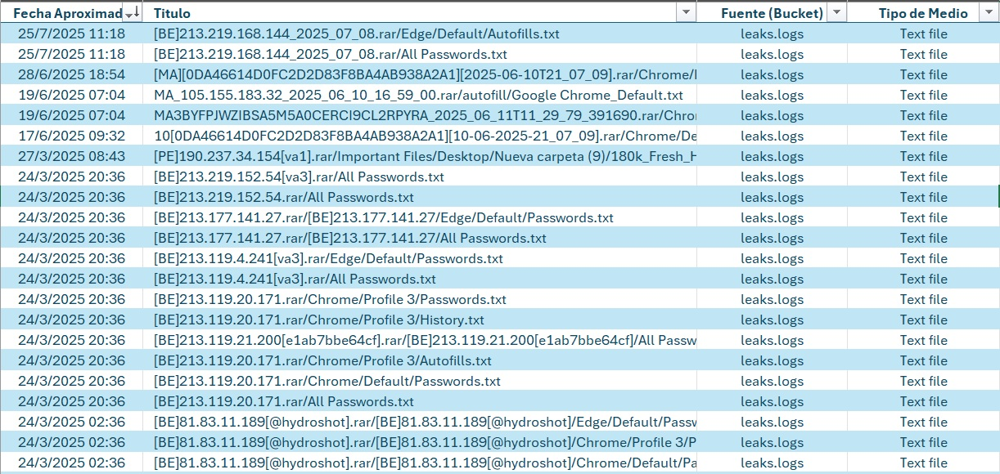

# IntelX Checker 🕵️‍♂️


> **IntelX Checker** — Aplicación avanzada para investigar filtraciones de datos y fuentes OSINT. Busca, visualiza y exporta resultados de Intelligence X en una interfaz moderna y profesional.

## Apoya el Proyecto
Esta herramienta es un proyecto de código abierto. Si te resulta útil, considera apoyar su desarrollo con una donación.

[](https://www.paypal.com/donate/?hosted_button_id=6W8LAAFX9BN6E)

## Tabla de Contenidos
- [Características Destacadas](#características-destacadas)
- [Ideal para](#ideal-para)
- [Screenshots](#screenshots)
- [Requisitos](#requisitos)
- [Instalación](#instalación)
- [Configuración](#configuración)
- [Uso](#uso)
- [Estructura de Carpetas](#estructura-de-carpetas)
- [Licencia](#licencia)
- [Créditos](#créditos)
- [Contacto y Soporte](#contacto-y-soporte)
- [Palabras Clave (SEO)](#palabras-clave-seo)

## Características Destacadas
- 🔍 **Búsqueda Potente:** Realiza búsquedas en la API de Intelligence X por correo electrónico o dominio.
- 🎯 **Filtro de Fuentes:** Selecciona las fuentes de datos (buckets) específicas en las que deseas buscar.
- 📊 **Visualización Clara:** Muestra los resultados en una tabla organizada que puedes ordenar por fecha, nombre, fuente o tipo.
- 💾 **Exportación Versátil:** Exporta los resultados de tu búsqueda a archivos CSV o JSON para un análisis posterior.
- 🔑 **Gestión Segura de API Key:** Guarda tu clave de API de Intelligence X de forma segura.
- 📚 **Documentación Integrada:** Visualización interna de manual y glosario para consulta rápida.
- ✨ **Interfaz Moderna:** Una interfaz limpia y fácil de usar con soporte para temas claro y oscuro.
- 🖼️ **Iconografía Consistente:** Todos los cuadros de diálogo muestran el icono de la aplicación.

### 🎯 Ideal para:
-   **Analistas de Seguridad:** Investigar filtraciones de datos y correlacionar información de OSINT.
-   **Investigadores Forenses:** Extraer y analizar datos de fuentes públicas y privadas.
-   **Profesionales de Ciberseguridad:** Monitorear la exposición de credenciales y dominios.

## Screenshots

**Pantalla Principal**


**Exportación de Tabla CSV**


## 🚀 Requisitos

- **Python 3.10 o superior**
- Las dependencias de Python listadas en `requirements.txt`:
    - `customtkinter`
    - `tkhtmlview`
    - `markdown2`
    - `Pillow`
    - `requests`
    - `python-dotenv`

## ⚙️ Instalación

1.  **Clona el repositorio:**
    ```bash
    git clone https://github.com/mikear/IntelX-Checker.git
    cd IntelX-Checker
    ```

2.  **Crea un entorno virtual (recomendado):**
    ```bash
    python -m venv venv
    # En Windows
    .\venv\Scripts\activate
    # En macOS/Linux
    source venv/bin/activate
    ```

3.  **Instala las dependencias:**
    ```bash
    pip install -r requirements.txt
    ```

## Configuración
Para funcionar, la aplicación necesita tu clave de API de Intelligence X.

1.  **Obtén tu clave:**
    -   **Intelligence X:** Consigue tu clave en [intelx.io](https://intelx.io/account?tab=developer).

2.  **Configura la clave:**
    -   **Método GUI (Recomendado):**
        -   Inicia la aplicación gráfica.
        -   Ve al menú `Configuración` > `Gestionar Clave API...`
        -   Pega tu clave en el campo correspondiente y guarda. Se creará un archivo `.env` automáticamente.
    -   **Método Manual:**
        -   Crea un archivo llamado `.env` en la raíz del proyecto.
        -   Añade la siguiente línea, reemplazando `TU_CLAVE_AQUI` con tu clave real:
          ```
          INTELX_API_KEY=TU_CLAVE_AQUI
          ```

## ▶️ Uso

1. **Ejecuta la aplicación:**
    ```bash
    python main.py
    ```
2. **Configura tu API Key:**
    - Ve a `Configuración` > `Gestionar Clave API...`
    - Introduce tu clave de API de Intelligence X.
3. **Realiza una búsqueda:**
    - Introduce el correo o dominio en el campo de búsqueda.
    - Haz clic en `Buscar`.
    - Los resultados aparecerán en la tabla.
4. **Exporta resultados:**
    - Usa el menú `Archivo` para exportar a CSV o JSON.
5. **Consulta el manual y glosario:**
    - Accede desde el menú `Ayuda` y visualízalos en ventanas internas con scroll.

## 📁 Estructura de Carpetas
- `intelx/` : Lógica de API y GUI
- `docs/` : Manual, glosario, icono
- `exports/csv` : Resultados exportados
- `requirements.txt` : Dependencias
- `docs/assets/` : Prints de pantalla y recursos gráficos

## 📄 Licencia
Este proyecto está bajo la Licencia MIT. Consulta el archivo `LICENSE` para más detalles.

## 💖 Créditos
Desarrollado por Diego A. Rábalo.
Este proyecto utiliza las siguientes librerías de código abierto:
- **customtkinter:** Para la interfaz gráfica de usuario.
- **tkhtmlview:** Para la visualización de HTML.
- **markdown2:** Para la conversión de Markdown a HTML.
- **Pillow:** Para el procesamiento de imágenes.
- **requests:** Para realizar peticiones HTTP.
- **python-dotenv:** Para la gestión de variables de entorno y claves API.

## 📞 Contacto y Soporte
- 📧 **Correo Electrónico:** [diego_rabalo@hotmail.com](mailto:diego_rabalo@hotmail.com)
- 🔗 **LinkedIn:** [Diego A. Rábalo](https://www.linkedin.com/in/rabalo)

## 🔑 Palabras Clave (SEO)
IntelX Checker, Intelligence X, OSINT, Filtraciones de Datos, Ciberseguridad, Python, GUI, Windows, Análisis de Datos, Exportación CSV, Exportación JSON.
