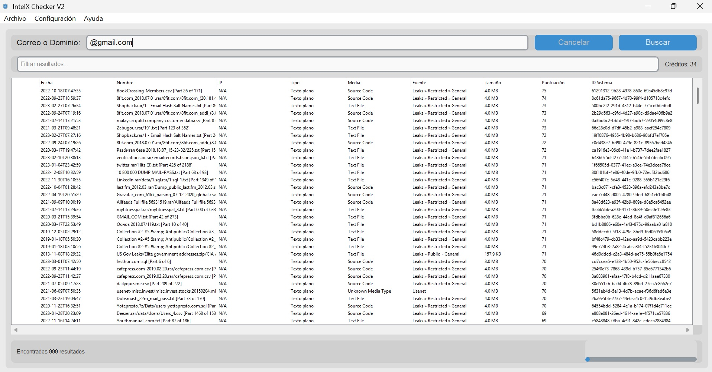
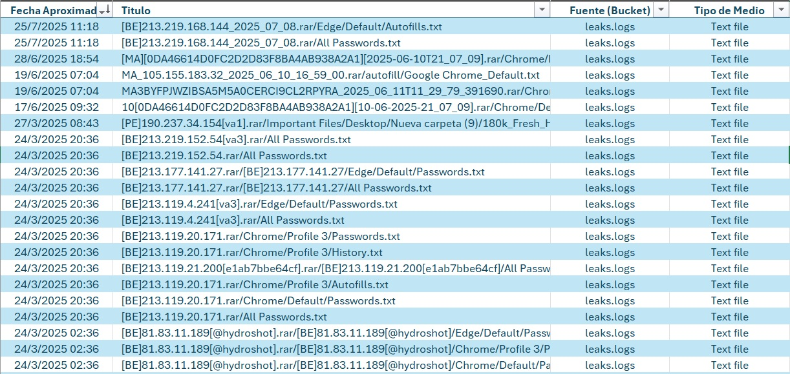
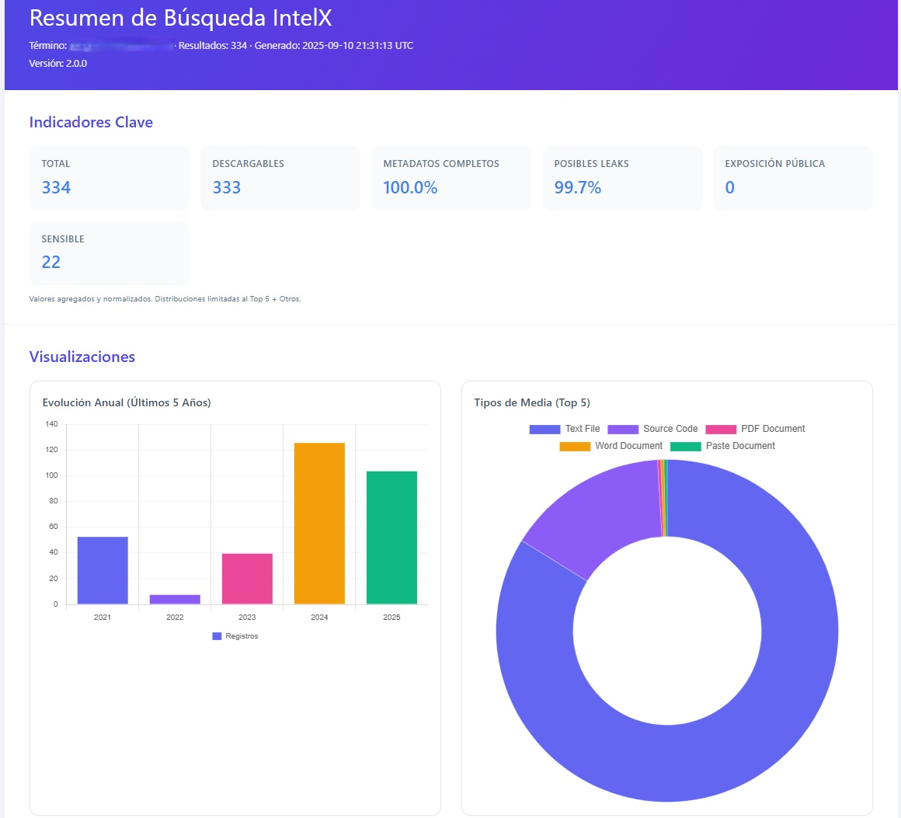

# IntelX Checker V2 🕵️‍♂️


> **IntelX Checker** — Aplicación avanzada para investigar filtraciones de datos y fuentes OSINT. Busca, visualiza y exporta resultados de Intelligence X en una interfaz moderna y profesional con **reportes interactivos SVG**.

## 🆕 Nuevas Características V2.1
-   **Acumulación de Resultados:** Las búsquedas acumulan hallazgos sin duplicados. Cada nueva consulta agrega resultados nuevos a los existentes.
-   **Persistencia de Datos:** Los resultados se guardan automáticamente en `data/history.json` y sobreviven reinicios de la aplicación.
-   **Deduplicación Inteligente:** Los registros se deduplican por `systemid`/`storageid` para evitar resultados repetidos.
-   **Limpiar Historial:** Opción en menú `Archivo > Limpiar Historial` para borrar todos los resultados acumulados.
- 📊 **Reportes Interactivos SVG:** Gráficos standalone sin dependencias externas
- 🎯 **3 Visualizaciones Clave:** Distribución de tipos, fuentes principales y evolución temporal (5 años)
- 📱 **Diseño Completamente Responsivo:** Funciona perfectamente en cualquier dispositivo
- 🚀 **100% Offline:** Los reportes funcionan sin conexión a Internet
- 📈 **Gráficos Ampliados:** Visualizaciones más grandes y legibles
- 🎨 **Interfaz Moderna:** Diseño Windows 11/macOS con tipografía optimizada

## Apoya el Proyecto
Esta herramienta es un proyecto de código abierto. Si te resulta útil, considera apoyar su desarrollo con una donación.

[](https://www.paypal.com/donate/?hosted_button_id=6W8LAAFX9BN6E)

## Tabla de Contenidos
- [Nuevas Características V2.1](#-nuevas-características-v21)
- [Características Destacadas](#características-destacadas)
- [Reportes Interactivos](#-reportes-interactivos)
- [Ideal para](#ideal-para)
- [Screenshots](#screenshots)
- [Instalación Rápida](#-instalación-rápida)
- [Uso](#uso)
- [Estructura de Carpetas](#estructura-de-carpetas)
- [Licencia](#licencia)
- [Créditos](#créditos)
- [Contacto y Soporte](#contacto-y-soporte)

## Características Destacadas
- 🔍 **Búsqueda Potente:** Realiza búsquedas en la API de Intelligence X por correo electrónico o dominio.
-   **Acumulación de Resultados:** Las búsquedas se acumulan sin duplicados. Cada nueva consulta agrega hallazgos nuevos a los existentes.
-   **Persistencia Automática:** Los resultados se guardan en disco y sobreviven reinicios de la aplicación.
- 🎯 **Filtro de Fuentes:** Selecciona las fuentes de datos (buckets) específicas en las que deseas buscar.
- 📊 **Reportes SVG Interactivos:** Gráficos modernos sin dependencias JavaScript externas.
- 💾 **Exportación Versátil:** Exporta a CSV, JSON y **HTML interactivo** para análisis posterior.
- 🔑 **Gestión Segura de API Key:** Guarda tu clave de API de Intelligence X de forma segura.
- 📚 **Documentación Integrada:** Visualización interna de manual y glosario para consulta rápida.
- ✨ **Interfaz Moderna:** Una interfaz limpia y fácil de usar con soporte para temas claro y oscuro.
- 🖼️ **Iconografía Consistente:** Todos los cuadros de diálogo muestran el icono de la aplicación.

## 📊 Reportes Interactivos

### Características de los Reportes HTML
- **🍩 Gráfico de Distribución:** Tipos de datos encontrados (donut chart)
- **📊 Gráfico de Fuentes:** Top fuentes de información (bar chart)  
- **📈 Evolución Temporal:** Tendencias de 5 años por trimestres (line chart)
- **🔍 Tabla Filtrable:** Datos completos con filtros por tipo y fuente
- **📱 Responsive Design:** Se adapta a cualquier tamaño de pantalla
- **🚀 Standalone:** Funciona sin Internet, sin dependencias externas

### Generación de Reportes
```bash
# Desde la interfaz gráfica
Menu → Exportar → HTML Interactivo

# Desde línea de comandos
python generate_report.py
```

### 🎯 Ideal para:
-   **Analistas de Seguridad:** Investigar filtraciones de datos y correlacionar información de OSINT.
-   **Investigadores Forenses:** Extraer y analizar datos de fuentes públicas y privadas.
-   **Profesionales de Ciberseguridad:** Monitorear la exposición de credenciales y dominios.
-   **Equipos de Threat Intelligence:** Generar reportes visuales para presentaciones ejecutivas.

## Screenshots

**Pantalla Principal**


**Exportación de Tabla CSV**


**Reporte HTML Interactivo**


## 🚀 Instalación Rápida

### Requisitos
- **Python 3.10 o superior**
- Las dependencias de Python listadas en `requirements.txt`

### Instalación en 3 Pasos

1.  **Clona el repositorio:**
    ```bash
    git clone https://github.com/mikear/IntelX-Checker.git
    cd IntelX-Checker
    ```

2.  **Instala las dependencias:**
    ```bash
    pip install -r requirements.txt
    ```

3.  **Ejecuta la aplicación:**
    ```bash
    python main.py
    ```

### Dependencias Principales
- `customtkinter` - Interfaz gráfica moderna
- `tkhtmlview` - Visualización HTML integrada  
- `requests` - Comunicación con API de Intelligence X
- `Pillow` - Procesamiento de imágenes
- `python-dotenv` - Gestión de configuración
    # En Windows
    .\venv\Scripts\activate
    # En macOS/Linux
    source venv/bin/activate
    ```

3.  **Instala las dependencias:**
    ```bash
    pip install -r requirements.txt
    ```

## Configuración
Para funcionar, la aplicación necesita tu clave de API de Intelligence X.

1.  **Obtén tu clave:**
    -   **Intelligence X:** Consigue tu clave en [intelx.io](https://intelx.io/account?tab=developer).

2.  **Configura la clave:**
    -   **Método GUI (Recomendado):**
        -   Inicia la aplicación gráfica.
        -   Ve al menú `Configuración` > `Gestionar Clave API...`
        -   Pega tu clave en el campo correspondiente y guarda. Se creará un archivo `.env` automáticamente.
    -   **Método Manual:**
        -   Crea un archivo llamado `.env` en la raíz del proyecto.
        -   Añade la siguiente línea, reemplazando `TU_CLAVE_AQUI` con tu clave real:
          ```
          INTELX_API_KEY=TU_CLAVE_AQUI
          ```

## ▶️ Uso

1. **Ejecuta la aplicación:**
    ```bash
    python main.py
    ```
2. **Configura tu API Key:**
    - Ve a `Configuración` > `Gestionar Clave API...`
    - Introduce tu clave de API de Intelligence X.
3. **Realiza una búsqueda:**
    - Introduce el correo o dominio en el campo de búsqueda.
    - Haz clic en `Buscar`.
    - Los resultados aparecerán en la tabla.
    - **Los resultados se acumulan:** cada nueva búsqueda agrega hallazgos nuevos a los existentes sin duplicar.
4. **Exporta resultados:**
    - Usa el menú `Archivo` para exportar a CSV, JSON, PDF o HTML interactivo.
5. **Limpiar historial:**
    - Si deseas empezar de cero, ve a `Archivo` > `Limpiar Historial`.
6. **Consulta el manual y glosario:**
    - Accede desde el menú `Ayuda` y visualízalos en ventanas internas con scroll.

## 📁 Estructura de Carpetas
- `src/` : Código fuente (API, GUI, utilidades)
- `data/` : Historial de resultados (generado automáticamente)
- `docs/` : Manual, glosario, icono
- `exports/csv` : Resultados exportados
- `reports/` : Reportes generados
- `requirements.txt` : Dependencias
- `docs/assets/` : Prints de pantalla y recursos gráficos

## 📄 Licencia
Este proyecto está bajo la Licencia MIT. Consulta el archivo `LICENSE` para más detalles.

## 💖 Créditos
Desarrollado por Diego A. Rábalo.
Este proyecto utiliza las siguientes librerías de código abierto:
- **customtkinter:** Para la interfaz gráfica de usuario.
- **tkhtmlview:** Para la visualización de HTML.
- **markdown2:** Para la conversión de Markdown a HTML.
- **Pillow:** Para el procesamiento de imágenes.
- **requests:** Para realizar peticiones HTTP.
- **python-dotenv:** Para la gestión de variables de entorno y claves API.

## 📞 Contacto y Soporte
- 📧 **Correo Electrónico:** [diego_rabalo@hotmail.com](mailto:diego_rabalo@hotmail.com)
- 🔗 **LinkedIn:** [Diego A. Rábalo](https://www.linkedin.com/in/rabalo)

## 🔑 Palabras Clave (SEO)
IntelX Checker, Intelligence X, OSINT, Filtraciones de Datos, Ciberseguridad, Python, GUI, Windows, Análisis de Datos, Exportación CSV, Exportación JSON.