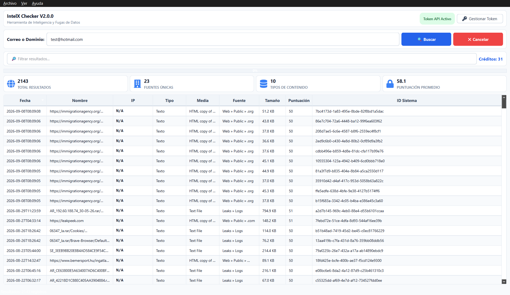
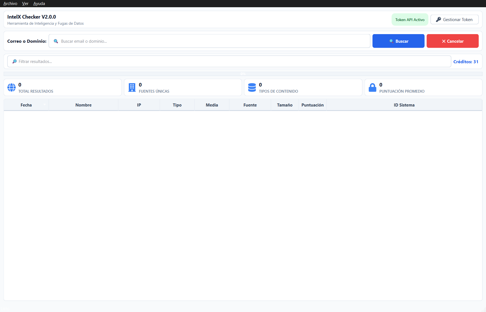
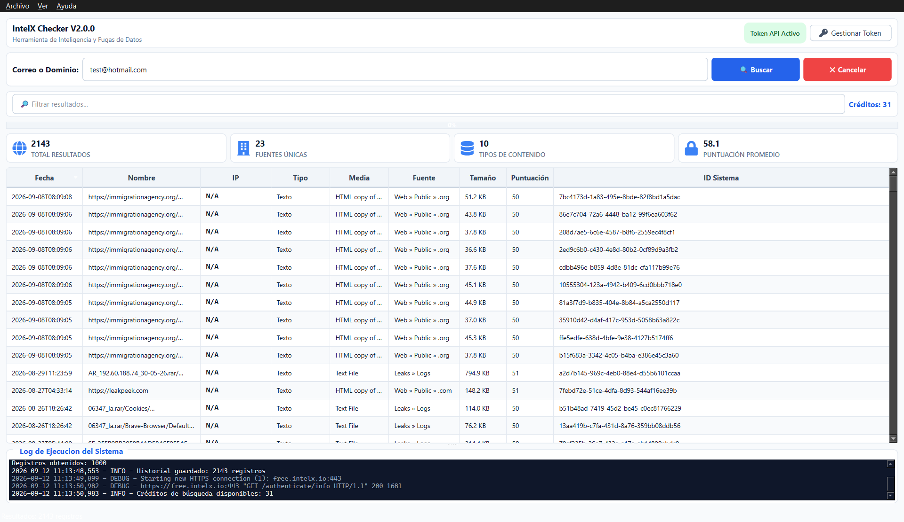

# IntelX Checker V2



**IntelX Checker** — Herramienta de escritorio para investigar filtraciones de datos y fuentes OSINT a traves de la API de Intelligence X. Busca, visualiza y exporta resultados en una interfaz moderna con reportes interactivos SVG.

## Caracteristicas

- **Busqueda en Intelligence X** por correo electronico o dominio
- **Acumulacion de resultados** sin duplicados (por `systemid`/`storageid`)
- **Persistencia automatica** en `data/history.json`
- **4 KPI cards**: Total, Fuentes, Tipos de Contenido, Puntuacion Promedio
- **Tabla interactiva** con 9 columnas, ordenamiento y filtro por texto
- **Log de ejecucion** dark terminal (toggle desde Ver > Log)
- **Exportacion**: CSV, JSON, PDF, HTML interactivo con graficos SVG
- **API key segura** via keyring del sistema
- **Bilingue**: Espanol / English

## Screenshots

**Pantalla inicial**


**Resultados de busqueda** (`test@hotmail.com`)


**Con log de ejecucion**


## Instalacion

### Requisitos
- Python 3.10+

### Pasos

```bash
git clone https://github.com/mikear/IntelX-Checker.git
cd IntelX-Checker
pip install -r requirements.txt
python src/main.py
```

### Dependencias

| Paquete | Uso |
|---------|-----|
| `PySide6` | GUI (Qt for Python) |
| `qtawesome` | Iconos FontAwesome |
| `requests` | Comunicacion con API IntelX |
| `python-dotenv` | Gestion de .env |
| `keyring` | Almacenamiento seguro de API key |
| `matplotlib` | Graficos para reportes |
| `pandas` | Analisis de datos |
| `reportlab` | Generacion de PDF |

## Configuracion

1. Obtén tu clave en [intelx.io/account](https://intelx.io/account?tab=developer)
2. Al iniciar la app, haz clic en **Gestionar Token** y pega tu clave
3. La clave se guarda en el keyring del sistema (nunca en texto plano)

## Uso

```bash
# Modo grafico
python src/main.py

# Modo CLI
python src/main.py --cli -s "email@ejemplo.com" -e json -o exports/
```

### Atajos de teclado
- `Enter` en el campo de busqueda: ejecutar busqueda
- Click derecho en la tabla: menu contextual (Vista Previa, Copiar, Exportar)
- Doble click: vista previa del registro

## Estructura

```
src/
├── main.py                 # Entry point (GUI + CLI)
├── gui.py                  # Ventana principal PySide6
├── ui_components.py        # Dialogos reutilizables
├── api.py                  # Logica API IntelX
├── config.py               # .env + keyring
├── exports.py              # CSV/JSON/PDF/HTML
├── utils.py                # Historial, dedup, helpers
├── i18n.py                 # Multilenguaje (es/en)
├── analysis.py             # IOC extraction
├── interactive_report.py   # Generador HTML interactivo
├── svg_charts.py           # Graficos SVG
└── keyring_storage.py      # API key en keyring del SO
```

## Licencia

MIT License. Ver `LICENSE`.

## Creditos

Desarrollado por **Diego A. Rabalo** | [@mikear](https://github.com/mikear)

- [PySide6](https://pypi.org/project/PySide6/) — Qt for Python
- [QtAwesome](https://pypi.org/project/qtawesome/) — FontAwesome icons
- [Intelligence X API](https://intelx.io/) — Data source

## Contacto

- Email: diego_rabalo@hotmail.com
- LinkedIn: [Diego A. Rabalo](https://www.linkedin.com/in/rabalo)
- GitHub: [mikear](https://github.com/mikear)
